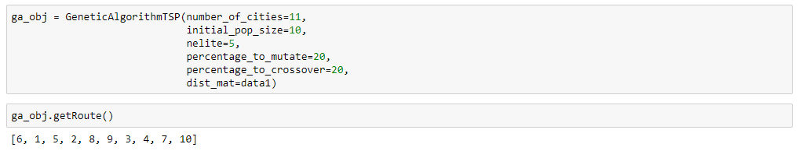
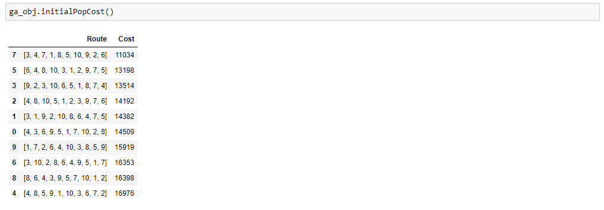
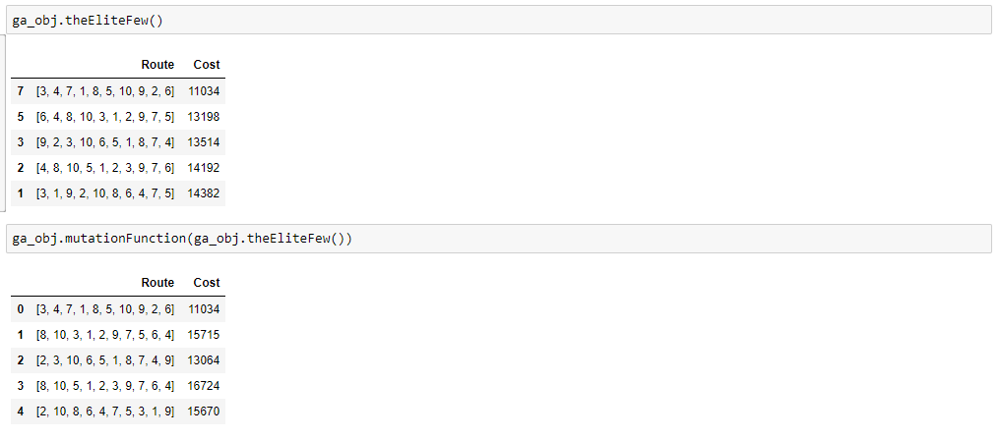
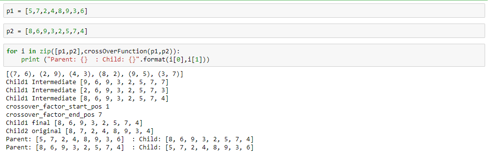
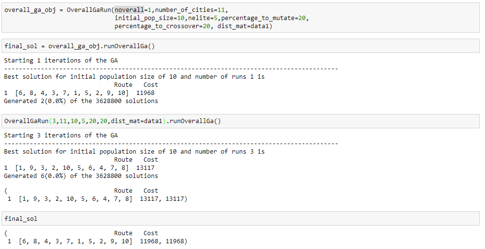
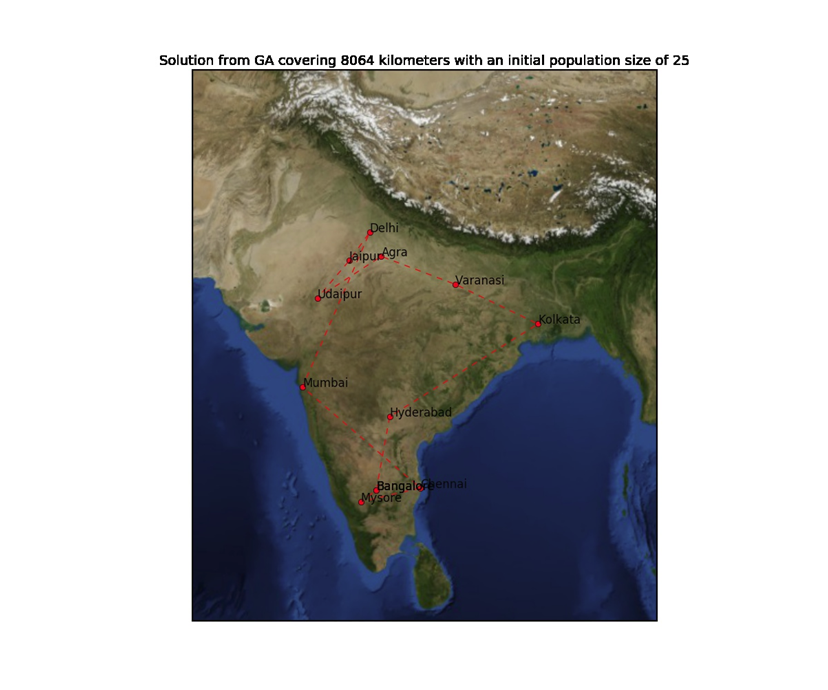
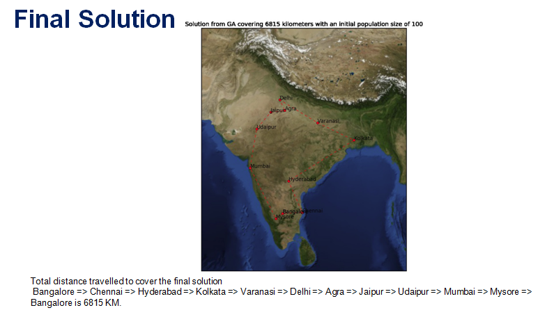

# GeneticAlgorithmTSP
## Genetic algorithm code for solving Travelling Salesman Problem

Programming Language : Python
Number of cities : 11

General flow of solving a problem using Genetic Algorithm
                {
                  initialize population;
                  evaluate population;
                  while TerminationCriteriaNotSatisfied
                {
                  select parents for reproduction;
                  perform recombination and mutation;
                  evaluate population;
                }

Initialize population:
The initial population is a set of random routes generated using numpy.

Evaluate population:
The evaluation is a process of finding how good the solutions is. This is 

Mutation:

Crossover:
Implemented PMX by goldberg - https://www.hindawi.com/journals/cin/2017/7430125/

OverallRun:

## The solution obtained from Running Genetic algorithm

Starting:

Final:

_Note: The final solution was obtained after multiple runs of the Genetic Algorithm with different inital population sizes and overall runs._